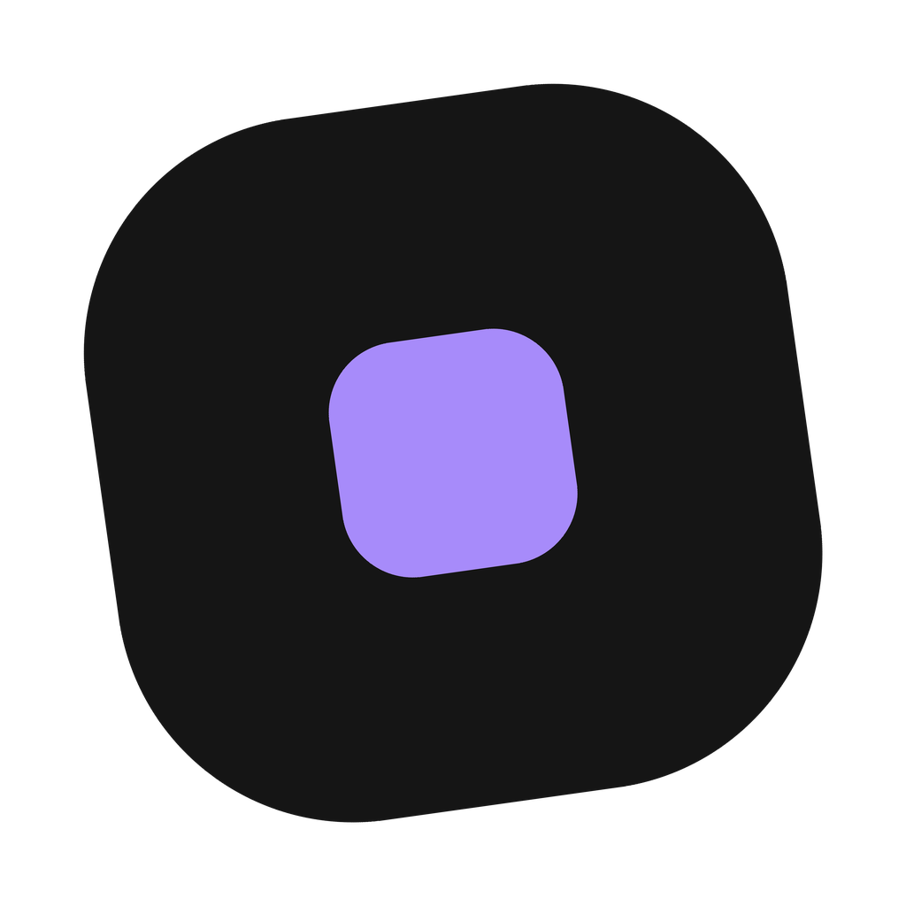

# Continue

A Continue é uma engine para criar jogos diretamente pelo celular. Ela foi feita para transformar ideias em jogos de forma visual, organizada e fácil de entender.

## Crie seu jogo do seu jeito

Na Continue, você pode montar fases, menus e telas usando cenas. Dentro de cada cena, é possível adicionar objetos, posicionar suas instâncias, organizar camadas e acompanhar tudo pelo editor visual.

## Dê vida aos objetos

Os comportamentos adicionam recursos prontos aos objetos, como:

- Sprites e animações.
- Gravidade e colisão.
- Movimento pelo toque.
- Arrastar e soltar.
- Luzes e sombras.
- Animação de propriedades.
- Variáveis próprias do objeto.

## Monte a lógica visualmente

O sistema de scripts visuais permite conectar ações, condições e repetições para definir o funcionamento do jogo. Você pode movimentar objetos, controlar a câmera, verificar toques, criar animações e organizar diferentes fluxos sem precisar escrever código.

## Teste e exporte

O visualizador permite acompanhar o jogo durante a criação. Quando o projeto estiver pronto, ele pode ser preparado para jogar no Windows com seu próprio nome, versão e ícone.

## Aprenda a usar a Continue

Esta documentação explica o editor, os comportamentos, as ações, as condições, as expressões e a exportação do jogo de maneira simples e direta.

[Começar pela documentação](docs/primeiros-passos/conheca-a-engine.md)
